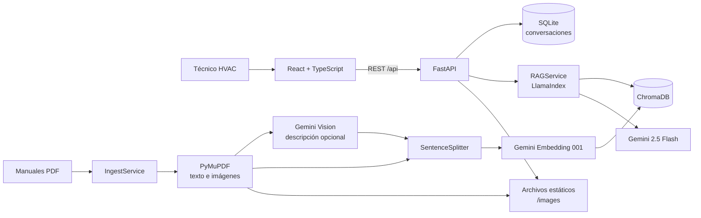

# RAG HVAC Assistant

Prototipo académico de un asistente técnico basado en **Generación Aumentada por Recuperación (RAG)** para apoyar el diagnóstico y mantenimiento de sistemas de climatización tipo Split. La aplicación recupera fragmentos de manuales de servicio, los utiliza como contexto para un modelo Gemini y presenta la respuesta junto con sus fuentes documentales y, cuando corresponde, imágenes de diagramas relevantes.

> **Advertencia de uso:** el sistema es una herramienta de apoyo y no sustituye el criterio, la capacitación ni las medidas de seguridad de un técnico HVAC. La recuperación documental reduce el riesgo de respuestas sin fundamento, pero no elimina las alucinaciones ni valida que una consulta pertenezca al dominio del manual cargado.

## Contexto académico

Este repositorio contiene el prototipo desarrollado como resultado del trabajo de graduación:

**«Sistema de generación aumentada por recuperación (RAG) basado en datos vectoriales para contextualización de diagnósticos técnicos: caso de estudio en sistemas de climatización Split»**

- **Institución:** Universidad Centroamericana José Simeón Cañas (UCA).
- **Facultad:** Facultad de Ingeniería y Arquitectura.
- **Carrera:** Ingeniería Informática.
- **Autores:** Rodrigo Andrés Mena Caballero, Duglas Fernando Pineda Fuentes y Mario Antonio Martinez Villatoro.
- **Director del trabajo:** James Edward Humberstone Morales.
- **Fecha y lugar:** junio de 2026, Antiguo Cuscatlán, El Salvador.

La investigación aborda la dificultad de localizar códigos de error, procedimientos y diagramas en manuales técnicos extensos, así como el riesgo de obtener respuestas generales o incorrectas de modelos de lenguaje sin acceso controlado a documentación oficial. El caso de estudio se delimitó a equipos Split residenciales y comerciales ligeros, convencionales e Inverter, de 9,000 a 24,000 BTU.

La evaluación académica reportó 14 respuestas correctas y completas de 15 preguntas específicas (93 %) y cita explícita del manual en 13 de 15 casos (87 %), en sesiones con cinco técnicos. Estas cifras describen el experimento documentado en la tesis; no representan un acuerdo de nivel de servicio ni una garantía para otros manuales, consultas o entornos.

## Funcionalidades implementadas

- Consulta conversacional en español o inglés, con español como idioma predeterminado ante entradas ambiguas.
- Dos perfiles de recuperación: diagnóstico general y consulta de códigos de error.
- Filtro opcional por marca inferida del nombre del manual.
- Historial persistente de conversaciones y mensajes en SQLite.
- Siete perfiles de demostración aislados mediante la cabecera `X-Demo-User`.
- Carga, listado, descarga y eliminación de manuales PDF.
- Ingesta en segundo plano con progreso por fases.
- Extracción de texto por página, fragmentación e indexación persistente en ChromaDB.
- Descripción con Gemini Vision de páginas con contenido gráfico relevante.
- Extracción o renderizado local de diagramas y galería contextual en el chat.
- Respaldo documental con nombre de archivo, página, fragmento y puntuación de similitud.
- Selección automática entre claves de Google de pago y gratuita ante errores de cuota.
- Interfaz adaptable para escritorio y dispositivos móviles.

## Arquitectura



El backend separa la ingesta de la consulta. `IngestService` transforma los PDF en nodos con metadatos y los inserta en ChromaDB; `RAGService` abre la colección ya indexada, recupera los nodos pertinentes y solicita al LLM una síntesis fundamentada. El historial reciente de la conversación se incorpora como contexto auxiliar, sin reemplazar la recuperación documental.

### Flujo de una consulta

1. El frontend crea o reutiliza una conversación y envía `message`, `conversation_id` y, opcionalmente, `brand`.
2. El backend recupera hasta 20 mensajes recientes, limitados a 3,500 caracteres.
3. `RAGService` infiere el perfil de consulta:
   - `error_code`: `top_k=3`, síntesis `compact`;
   - `diagnosis`: `top_k=5`, síntesis `tree_summarize`;
   - consulta explícita de diagramas: hasta `top_k=8`.
4. ChromaDB recupera fragmentos; un filtro opcional restringe la marca.
5. Gemini genera la respuesta con un prompt que exige utilizar el contexto proporcionado y declarar información insuficiente.
6. El backend filtra las fuentes por similitud, limita la galería y persiste el turno en SQLite.

### Flujo de ingesta

1. `POST /api/documents/upload` valida la extensión, el tamaño y la inexistencia de un archivo homónimo.
2. PyMuPDF extrae texto e imágenes por página. Las páginas vectoriales complejas pueden renderizarse como imagen completa.
3. Las páginas con poco texto y contenido visual significativo pueden describirse mediante Gemini Vision.
4. `SentenceSplitter` genera fragmentos de 1,024 tokens con 200 tokens de superposición.
5. `gemini-embedding-001` produce las representaciones vectoriales.
6. Los nodos se insertan por lotes en la colección persistente `hvac_manuals` y se invalida la caché del índice.

Solo se procesa una ingesta a la vez. El estado se conserva en memoria y se perderá si el proceso del backend se reinicia.

## Tecnologías verificadas

| Capa | Tecnología versionada |
|---|---|
| Interfaz | React 19.2.4, React DOM 19.2.4, TypeScript 5.9.3 |
| Construcción y estilos | Vite 8.0.1, Tailwind CSS 4.2.2, Lucide React 1.7.0 |
| API | Python 3.12 en Docker, FastAPI 0.115.12, Uvicorn 0.34.2 |
| Orquestación RAG | LlamaIndex Core 0.14.21 |
| LLM y visión | Google GenAI 1.73.1, `models/gemini-2.5-flash` por defecto |
| Embeddings | `gemini-embedding-001` |
| Almacén vectorial | ChromaDB 0.6.3 |
| Extracción PDF | PyMuPDF 1.27.2.3 |
| Persistencia conversacional | SQLite + SQLAlchemy 2.0.41 |

## Estructura del repositorio

```text
rag-hvac-assistant/
├── backend/
│   ├── app/
│   │   ├── api/          # Rutas de salud, chat, conversaciones y documentos
│   │   ├── core/         # Configuración, rutas de datos y dependencias
│   │   ├── db/           # Modelos, sesión y migración ligera de SQLite
│   │   ├── rag/          # LLM, embeddings, prompts, PDF, visión y ChromaDB
│   │   ├── schemas/      # Contratos Pydantic
│   │   ├── services/     # RAG, ingesta y gestión de documentos
│   │   └── util/         # Contexto conversacional e idioma
│   ├── data/
│   │   ├── chroma_db/    # Índice vectorial generado localmente
│   │   ├── manuals/      # PDF cargados localmente
│   │   └── conversations.db
│   ├── Dockerfile
│   └── requirements.txt
└── frontend/
    ├── src/
    │   ├── app/          # Proveedores globales
    │   ├── components/   # Layout y componentes compartidos
    │   ├── features/     # Chat, manuales, cuentas demo y créditos
    │   ├── hooks/        # Hooks compartidos
    │   └── lib/          # API base, persistencia y utilidades
    ├── package.json
    └── vite.config.ts
```

Los manuales, imágenes extraídas y vectores no se distribuyen en Git. La base `backend/data/conversations.db` sí está versionada para la demostración académica y actualmente actúa como persistencia compartible; no debe utilizarse así con datos sensibles o en producción.

## Requisitos

- Python 3.10 o superior; la imagen Docker utiliza Python 3.12.
- Node.js compatible con Vite 8.
- `pnpm` para el frontend.
- Una clave de Google AI Studio en `GOOGLE_API_KEY`, `GOOGLE_API_KEY_FREE` o ambas.
- Manuales de servicio en PDF con texto seleccionable para obtener mejores resultados.

## Instalación local

### 1. Backend

Ejecute los comandos desde `backend/`; esta ubicación es necesaria para resolver el paquete `app` y cargar `backend/.env`.

```bash
cd backend
python3 -m venv .venv
source .venv/bin/activate
pip install -r requirements.txt
cp .env.example .env
```

Configure como mínimo una clave en `backend/.env`:

```dotenv
GOOGLE_API_KEY=clave_de_pago_opcional
GOOGLE_API_KEY_FREE=clave_gratuita_opcional
```

Inicie la API:

```bash
uvicorn app.main:app --reload --host 0.0.0.0 --port 8000
```

Recursos de desarrollo:

- Swagger UI: `http://127.0.0.1:8000/docs`
- ReDoc: `http://127.0.0.1:8000/redoc`
- Estado: `http://127.0.0.1:8000/api/health`

### 2. Frontend

En otra terminal:

```bash
cd frontend
pnpm install
pnpm dev
```

Abra `http://localhost:5173`. Por defecto, la SPA consume `http://127.0.0.1:8000`. Para utilizar otra dirección, cree `frontend/.env.local`:

```dotenv
VITE_API_BASE_URL=http://servidor:8000
```

### 3. Primer manual

1. Abra **Manuales técnicos**.
2. Cargue un PDF y espere a que finalicen extracción, fragmentación e indexación.
3. Regrese al chat e inicie un diagnóstico.

Copiar un PDF directamente a `backend/data/manuals/` no lo indexa. La ingesta debe ejecutarse mediante la interfaz o `POST /api/documents/upload`.

## Ejecución del backend con Docker

```bash
docker build -t rag-hvac-backend backend
docker run --rm -p 8000:8000 \
  --env-file backend/.env \
  -v "$(pwd)/backend/data:/app/data" \
  rag-hvac-backend
```

El contenedor utiliza un solo worker porque el bloqueo y el progreso de ingesta residen en memoria. El repositorio no incluye Docker Compose ni una imagen del frontend.

## Convención recomendada para los PDF

```text
100_ServiceManual_Daikin_FTXS-L_FDXS-L_Series.pdf
```

La marca se infiere a partir del primer segmento posterior a `_ServiceManual_` y se almacena en minúsculas. Esta convención habilita un filtro de marca más predecible; el backend no valida fabricante ni modelo contra un catálogo.

## Configuración principal del backend

| Variable | Valor predeterminado | Propósito |
|---|---:|---|
| `GOOGLE_API_KEY` | vacío | Clave primaria, normalmente de pago |
| `GOOGLE_API_KEY_FREE` | vacío | Clave gratuita o de respaldo ante cuota |
| `GEMINI_LLM_MODEL` | `models/gemini-2.5-flash` | Modelo generativo |
| `GEMINI_EMBEDDING_MODEL` | `gemini-embedding-001` | Modelo de embeddings |
| `RAG_CHUNK_SIZE` | `1024` | Tamaño del fragmento |
| `RAG_CHUNK_OVERLAP` | `200` | Superposición entre fragmentos |
| `RAG_DIAGNOSIS_TOP_K` | `5` | Recuperación para diagnóstico |
| `RAG_ERROR_CODE_TOP_K` | `3` | Recuperación para códigos |
| `RAG_DIAGRAM_TOP_K` | `8` | Recuperación para diagramas |
| `CHROMA_DB_PATH` | `data/chroma_db` | Persistencia vectorial |
| `CONVERSATIONS_DB_PATH` | `data/conversations.db` | Persistencia de chat |
| `MAX_UPLOAD_MB` | `50` | Límite de carga por PDF |
| `EMBEDDING_BATCH_SIZE` | `100` | Lote con clave de pago |
| `FREE_EMBEDDING_BATCH_SIZE` | `5` | Lote con clave gratuita |
| `FREE_EMBEDDING_MIN_INTERVAL_SECONDS` | `12.0` | Pausa de cuota gratuita |
| `DIAGRAM_VISION_ENABLED` | `true` | Visión y extracción de galería |
| `DIAGRAM_VISION_MAX_PAGES_PER_PDF` | `10` | Páginas de visión con perfil de pago |
| `FREE_DIAGRAM_VISION_MAX_PAGES_PER_PDF` | `45` | Páginas de visión con perfil gratuito |
| `CORS_ORIGINS` | localhost y 127.0.0.1:5173 | Orígenes permitidos |

`backend/.env.example` contiene el perfil habitual, aunque no enumera todos los parámetros disponibles en `app/core/config.py`.

## API REST

| Método | Ruta | Descripción |
|---|---|---|
| `GET` | `/` | Metadatos y enlaces del servicio |
| `GET` | `/api/health` | Prueba básica de vida |
| `POST` | `/api/chat` | Consulta RAG y persistencia del turno |
| `POST` | `/api/conversations` | Crear conversación |
| `GET` | `/api/conversations` | Listar conversaciones de la cuenta demo |
| `GET` | `/api/conversations/{id}/messages` | Recuperar mensajes |
| `PATCH` | `/api/conversations/{id}` | Renombrar conversación |
| `DELETE` | `/api/conversations/{id}` | Eliminar conversación y mensajes |
| `GET` | `/api/documents` | Listar PDF e indicar si están indexados |
| `POST` | `/api/documents/upload` | Cargar un PDF e iniciar ingesta |
| `GET` | `/api/documents/ingest-status` | Consultar progreso de ingesta |
| `GET` | `/api/documents/{filename}/download` | Descargar un manual |
| `DELETE` | `/api/documents/{filename}` | Eliminar PDF, vectores e imágenes |
| `GET` | `/images/...` | Servir imágenes extraídas |

Ejemplo de consulta:

```bash
curl -X POST http://127.0.0.1:8000/api/chat \
  -H 'Content-Type: application/json' \
  -H 'X-Demo-User: default' \
  -d '{
    "message": "¿Qué significa el código E6 y qué debo revisar?",
    "brand": "daikin"
  }'
```

Respuesta simplificada:

```json
{
  "answer": "...",
  "sources": [
    {
      "text": "...",
      "file_name": "100_ServiceManual_Daikin_Modelo.pdf",
      "score": 0.62,
      "page_number": 45,
      "has_diagram_context": true,
      "image_urls": ["/images/100_ServiceManual_Daikin_Modelo/page45_render.png"]
    }
  ],
  "conversation_id": "uuid"
}
```

## Persistencia y estado

| Información | Ubicación | Durabilidad |
|---|---|---|
| PDF cargados | `backend/data/manuals/` | Disco local |
| Vectores y metadatos | `backend/data/chroma_db/` | Disco local |
| Imágenes de diagramas | `backend/data/images/` | Disco local |
| Conversaciones y mensajes | `backend/data/conversations.db` | SQLite local |
| Índice abierto | `RAGService._index` | Memoria del proceso |
| Progreso de ingesta | `IngestService._state` | Memoria del proceso |
| Vista e ID seleccionados | `localStorage` | Navegador |
| Cuenta demo elegida | `localStorage` | Navegador |

El historial efectivo se restaura desde el backend. La caché local versionada de la interfaz no constituye una fuente de persistencia autónoma para conversaciones completas.

## Verificación del código

El repositorio no contiene suites de pruebas ni configuración de integración continua. En la revisión documental del 16 de julio de 2026 se comprobó:

- parseo sintáctico correcto de los módulos Python versionados;
- `pnpm build`: correcto;
- `pnpm lint`: falla con cuatro incidencias de las reglas `react-hooks/set-state-in-effect` y `react-refresh/only-export-components`.

Para validar cambios:

```bash
cd frontend
pnpm build
pnpm lint
```

Además, debe realizarse una prueba manual completa: iniciar ambos servicios, cargar un PDF no sensible, esperar la ingesta, efectuar consultas generales y de código de error, revisar las fuentes, cambiar de cuenta demo y eliminar el manual.

## Limitaciones y riesgos conocidos

- **Sin autenticación real:** `X-Demo-User` identifica perfiles de prueba, pero cualquier cliente puede suplantarlos.
- **Sin guardrail de dominio:** no se comprueba que el equipo consultado esté cubierto por el manual. La tesis documenta una alucinación por transferencia de procedimientos desde Split hacia VRF.
- **Validación de PDF limitada:** se verifica extensión y tamaño, no firma, MIME, antivirus ni integridad antes de guardarlo.
- **Posible path traversal en cargas:** el nombre de archivo recibido no se sanea ni se comprueba contra el directorio raíz antes de escribirlo.
- **Ingesta no durable:** `BackgroundTasks` y el estado en memoria no forman una cola persistente; reinicios o múltiples workers no están soportados.
- **Concurrencia imperfecta:** la comprobación de ocupación y la reserva del trabajo no son atómicas.
- **Resultados parciales:** una ingesta fallida puede conservar PDF, imágenes o vectores insertados antes del error.
- **Dependencia externa:** latencia, disponibilidad y costo dependen de Google GenAI y de su cuota.
- **Sin OCR:** los PDF escaneados sin capa de texto pueden producir recuperación deficiente, aunque ciertas páginas se describan con visión.
- **Multimodalidad acotada:** el sistema indexa descripciones visuales y muestra imágenes, pero no envía diagramas al LLM durante cada consulta ni garantiza razonamiento visual completo.
- **Sin pruebas automatizadas:** no existe cobertura que detecte regresiones en API, recuperación o interfaz.
- **Manejo de error de ingesta incompleto en UI:** el estado de error puede dejar de mostrar el dock antes de presentar el detalle al usuario.
- **Accesibilidad parcial:** los diálogos no implementan atrapamiento ni restauración de foco.
- **Adjuntos de chat inactivos:** existen tipos y componentes auxiliares, pero el compositor actual solo envía texto.
- **Sin licencia:** no se incluye un archivo `LICENSE`; por tanto, no debe asumirse autorización de redistribución o uso fuera del marco definido por sus autores.

## Líneas de continuidad

Para futuras cohortes o trabajos derivados se recomiendan, en este orden:

1. Corregir saneamiento de rutas, validación real de PDF y exposición pública de recursos.
2. Incorporar autenticación, autorización y separación de datos por usuario.
3. Implementar guardrails que validen fabricante, modelo, tipo y capacidad antes de generar.
4. Formular preguntas aclaratorias ante consultas ambiguas o con poca información técnica.
5. Sustituir `BackgroundTasks` por una cola durable con trabajos idempotentes y reanudables.
6. Añadir migraciones formales, una base de datos administrada y almacenamiento de objetos.
7. Crear pruebas unitarias, de integración, de recuperación, de seguridad y de interfaz.
8. Construir un conjunto de evaluación versionado con métricas de recuperación y fidelidad.
9. Mejorar el pipeline multimodal para recuperar regiones de página y validar evidencia visual.
10. Resolver los errores de lint, los estados de error de ingesta y la accesibilidad de diálogos.

## Créditos

Desarrollado por Rodrigo Andrés Mena Caballero, Duglas Fernando Pineda Fuentes y Mario Antonio Martinez Villatoro como trabajo de graduación de Ingeniería Informática en la Universidad Centroamericana José Simeón Cañas, bajo la dirección de James Edward Humberstone Morales.
